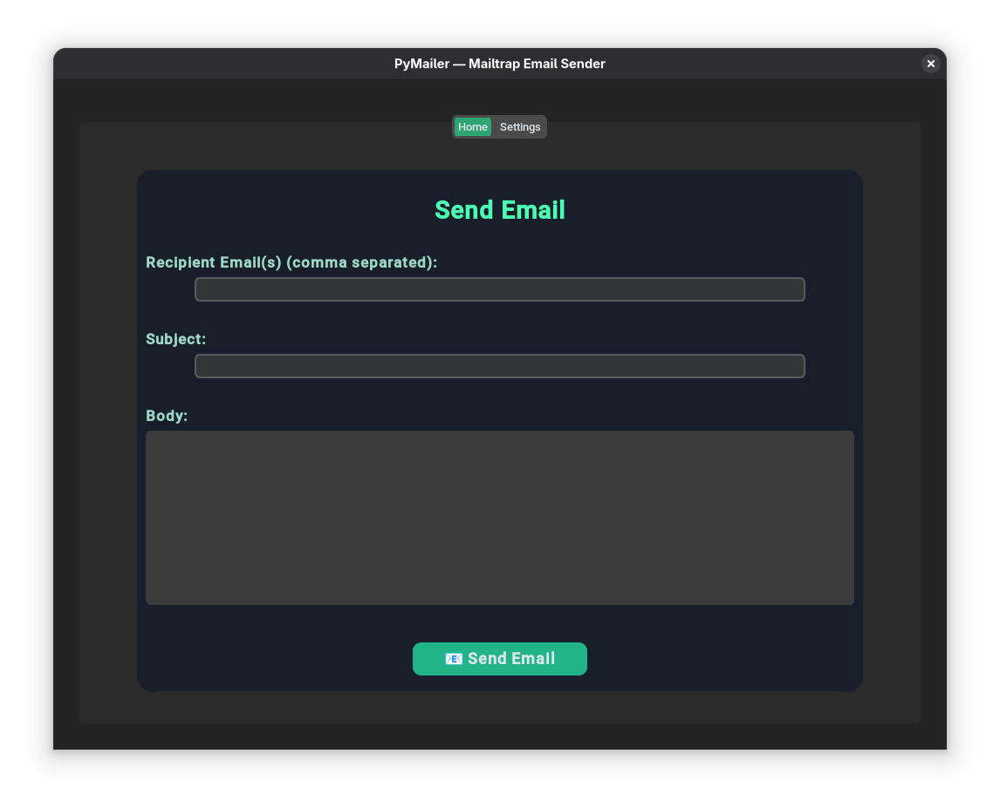
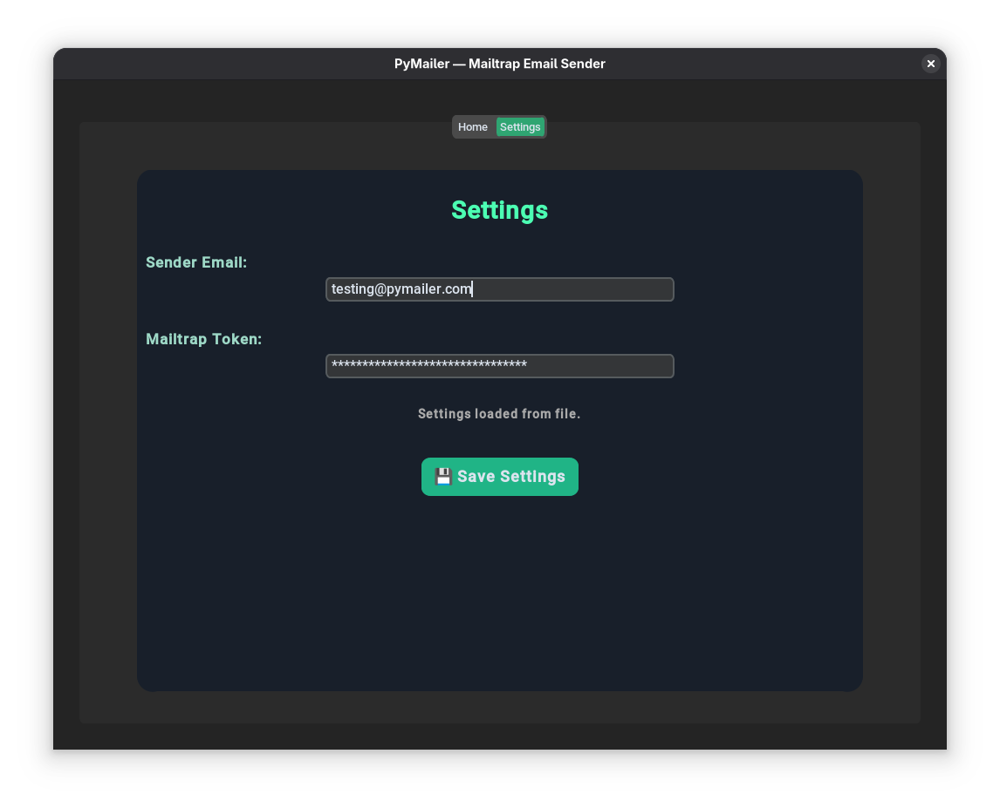

# PyMailer

**PyMailer** is a modern, customizable desktop email sender application built with [CustomTkinter](https://github.com/TomSchimansky/CustomTkinter) for a stylish UI. It allows you to send plain text or HTML emails easily via [Mailtrap](https://mailtrap.io/) SMTP, with multi-recipient support and settings storage.


---

## Features

- **Send Emails:** Easily send to one or multiple recipients (comma-separated).
- **HTML & Plain Text Supported:** Auto-detects HTML and sends accordingly.
- **Mailtrap SMTP Integration:** Secure, reliable testing with Mailtrap's API token.
- **Save & Load Settings:** Email and Mailtrap token are stored locally.

---

## Installation

1. **Clone this repository:**
   ```sh
   git clone https://github.com/yourusername/pymailer.git
   cd pymailer
   ```

2. **Install dependencies:**
   ```
   pip install customtkinter
   ```

3. **(Optional) Install Mailtrap:**
   - Sign up at [Mailtrap.io](https://mailtrap.io/)
   - Get your API token from your Inbox's SMTP settings.

---

## Usage

1. **Run the application:**
   ```
   python main.py
   ```

2. **Settings:**
   - Go to the "Settings" tab.
   - Enter your sender email and Mailtrap API token.
   - Click "Save Settings".

3. **Send Email:**
   - Go to the "Home" tab.
   - Enter recipient emails (comma-separated for multiple).
   - Enter subject and body (supports HTML).
   - Click "Send Email".

---

## Build Tutorial (Create Executable)

If you want to distribute PyMailer as a standalone app (so users don’t need to install Python):

### 1. Install PyInstaller

```sh
pip install pyinstaller
```

### 2. Build the Executable

Run this command in your project directory:
```sh
pyinstaller --onefile --windowed main.py
```
- `--onefile` creates a single executable file.
- `--windowed` (important for GUI apps) hides the command prompt window (Windows/macOS).

### 3. Find Your Executable

- The executable will be created in the `dist` folder inside your project directory.
- You can rename and distribute this file to others.

### 4. (Optional) Add an Icon

- Place your icon file (e.g., `icon.ico`) in your project folder.
- Add `--icon=icon.ico` to the PyInstaller command:
  ```
  pyinstaller --onefile --windowed --icon=icon.ico main.py
  ```

### 5. (Optional) Clean Up

After building, you can remove the extra `build/` and `__pycache__/` folders if you wish.

---

## Notes

- **Mailtrap only delivers to its sandbox inboxes by default.** Use for testing, not for actual delivery.
- The app auto-detects HTML content. Paste HTML or plain text; your recipient will see the styled result.
- Your settings (sender email & token) are saved to `settings.ini` in the app directory.

---

## Screenshot


---

## License

MIT License - see [LICENSE](LICENSE) for details.

---

## Credits

- [CustomTkinter](https://github.com/TomSchimansky/CustomTkinter)
- [Mailtrap](https://mailtrap.io/)
